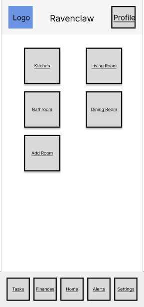

<h1 align="center">Bayt UX Design</h1>

# Prototype
The Figma prototype link for the Bayt app is <a align="center" href="https://www.figma.com/proto/rs9sNV0nIGotnT7L5qq2jz/Bayt?node-id=14%3A2&scaling=scale-down&page-id=0%3A1&starting-point-node-id=14%3A2">here.</a>

# App Map

  

# Wireframe Diagrams 

| UX-Wireframe | Description |
| --- | --- |
|  <i>Home Page</i>| This is the home page in which the user can view all available rooms in the house and add rooms. In the top right you have a profile icon and the footer contains the navigation bar with all the pages. The house name in the header or "Ravenclaw" represents the house name in which the user had been assigned to. |
|  <i>Room Template Page</i>| This shows the room and the tasks assigned to the room with a button to take you back to the Home page in which you selected the room. The task bars are buttons that will lead you to the Individual Task Page in which the user can edit/modify tasks. Also the square buttons on the left mark the task as complete or not.|
|  <i> Tasks Page</i>| This collectively shows all the tasks with the task buttons and the checkmark as stated in the previous description. The filter button allows you to filter task based on criterea such as date or room the task is assigned to, if any at all. The sort button allows you to sort in Chronological order to choose most recently due tasks or not. |
|  <i> Indiviual Task Page</i>| This shows the task details in which you can modify information relating to the task such as the date or time in which it is due to be completed. |
|  <i> Finances Page</i>| This page allows users to communicate and keep track of shared purchases in the living space. |
|  <i> Profile Page</i>| This page allows users to edit their profile details. |
|  <i> Alerts Page</i>| This is the page to which the user gets notified of near tasks that they are responsible for and the user is led to this page through the footer or through notification.|
|  <i> Settings Page</i>| Allows the user to modify the house details such as name, view whose in their housing group, and log out of their account if needed.|

